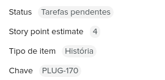

# Triggers

Os triggers (ou gatilhos) são funções que definem quando e quais informações a Pluga deve recuperar da sua aplicação.

As aplicações dentro da Pluga podem ter um, vários, ou mesmo nenhum trigger. Tudo depende se sua aplicação possui informações que sejam interessantes para serem fornecidas para [outras aplicações integradas na Pluga](https://pluga.co/ferramentas).

Para que uma automatização na Pluga funcione é necessário que exista um trigger numa aplicação A e um action numa aplicação B. O objetivo dessa seção é mostrar como criar triggers que permitirão à Pluga ligar sua aplicação as actions já presentes na nossa plataforma.

Cada trigger da sua aplicação deve ficar numa pasta em `lib/triggers`, sendo nomeada com o padrão [snake\_case](https://en.wikipedia.org/wiki/Snake\_case), contendo um arquivo JSON (`meta.json`) e um JavaScript (`index.js`). Como fizemos em outras seções, vamos explicar o processo a partir de exemplos reais.

## Configuração em JSON (meta.json)

No arquivo `meta.json` você vai configurar parâmetros como nome, atributos de retorno e outras informações estáticas do seu trigger.

Abaixo temos a configuração do trigger de **negócios ganhos** da aplicação [Agendor](https://pluga.co/ferramentas/agendor).


```javascript
{
  "name": "Negócio ganho/concluído",
  "description": "Recupera os negócios ganhos/concluídos, junto com a pessoa e empresa associada.",
  "trigger_fields": {
    "type": "local",
    "fields": [
      {
        "key": "id",
        "name": "ID",
        "field_type": "integer"
      },
      {
        "key": "dealStatus.name",
        "name": "Status",
        "field_type": "string"
      },
      {
        "key": "createdAt",
        "name": "Data/hora de cadastro",
        "field_type": "datetime"
      },
      {
        "key": "value",
        "name": "Valor total",
        "field_type": "decimal"
      },
      // ...
    ]
  },
  "idempotent": [
    "id"
  ],
  "trigger_type": "polling"
}
```


Vamos passar campo a campo para entender os seus significados e seus possíveis valores.

* **name**: Nome do seu trigger e como ele será chamado nas automatizações que serão geradas com ele.\

* **description**: Uma breve descrição sobre seu trigger e que informações ele resgata. Isso é bastante importante para que a equipe da Pluga possa entender melhor as possibilidades de combinação com outras aplicações.\

* **trigger\_fields**: A Pluga espera que seu trigger retorne uma lista de objetos JSON, onde cada objeto será um evento processado pela nossa plataforma. As configurações de `trigger_fields` definem quais atributos da sua API a Pluga pode disponibilizar para a configuração de automatizações.\

  * **type**: Define que estratégia a Pluga deve usar para listar os atributos do seu trigger. Podendo ser`local` quando todos os atributos serão listados estaticamente ou `remote` quando os campos serão obtidos a partir do método **fields** do arquivo JavaScript (`index.js`).\

  * **fields**: Lista de atributos que serão disponibilizados no painel da Pluga para que o usuário possa escolher quais dados do seu trigger ele deseja enviar para outras aplicações via automatização.\

    * **key**: Identificador do atributo em **dot notation**. Ou seja, para identificar o `email` em `{ "email": "johndoe@example.com" }` usamos `email` e em `{ "payer": { "email": "johndoe@example.com" } }` usamos `payer.email`.\

    * **name**: Nome do atributo que será exibido para o usuário.\

    * **field\_type**: Indica o tipo do atributo para que a Pluga possa fazer algumas conversões, quando necessário. Os valores possíveis são `string`, `integer`, `decimal` e `datetime`.\

* **idempotent**: Lista de atributos que serão levados em consideração como [idempotent](https://en.wikipedia.org/wiki/Idempotence). Em muitos casos os triggers podem retornar o mesmo objeto mais de uma vez para a Pluga, para evitar que isso gere eventos duplicados nas automatizações você deve definir quais atributos definem seus objetos únicos na sua API, geralmente um ID.\

*   **trigger\_type**: Define qual estratégia a Pluga deve usar para executar o seu trigger. Os valores possíveis são:\


    * **polling**: Para que a Pluga execute seu trigger periodicamente em busca de novos registros na sua API, geralmente a partir de requisições GET.\

    * **webhook**: Para que a Pluga aguarde requisições vindas da sua aplicação e só então execute seu trigger com as informações recebidas. Nesse modelo o usuário deverá copiar uma URL gerada pela Pluga para dentro da sua aplicação.\

    * **rest\_hook**: Muito similar ao modelo **webhook**, porém usando o conceito de [REST hooks](http://resthooks.org) para evitar que o usuário precise copiar uma URL gerada pela Pluga, proporcionando uma experiência fluida ao usuário junto com uma economia de iterações entre a Pluga e sua API.


*   **trigger\_rest\_hook**: ** `true`** quando o trigger é do tipo `rest_hook` deve  possuir os métodos `subscribe` e `unsubscribe` no `index.js`. Os métodos `subscribe` e `unsubscribe` estão detalhados em [Trigger do tipo rest\_hook](triggers.md#trigger-do-tipo-rest\_hook).

    &#x20;
*   **trigger\_custom\_fields**: **`true`** quando o trigger possui o método `custom_fields` no `index.js` para retornar os campos customizados do trigger. O método `custom_fields` está detalhado em [Listar campos customizados](triggers.md#listar-campos-customizados).


*   **trigger\_remote\_fields**: **`true`** quando o trigger possui o método no `fields` no `index.js` para retornar os atributos do trigger. O método `fields` está detalhado em [Listar atributos](triggers.md#listar-atributos).


* **trigger\_sample\_data**: **`true`** quando o `index.js` do trigger possui o método `sample` para retornar dados de exemplo. O método `sample` está detalhado em [Exemplo de evento](triggers.md#exemplo-de-evento).


A configuração de `key` dos `trigger_fields.fields` não suporta arrays, logo caso o seu trigger retorne algum dado em array você deve tratar esse dado na parte em JavaScript da integração, geralmente fazendo um **join**.

Mesmo que o campo`trigger_fields.type` esteja definido como `remote`, o campo `trigger_fields.fields` ainda poderá ser preenchido com os campos estáticos do seu trigger. Com isso, o retorno da função `fields` do arquivo `index.js` será concatenado ao conteúdo de `trigger_fields.fields`


### Trigger do tipo webhook/rest\_hook

Quando seu trigger for do tipo **webhook ou rest\_hook**,  além dos campos listados acima você deve configurar algumas informações no campo `webhook`.

Abaixo temos a configuração do trigger de **assinaturas criadas** da aplicação [Vindi](https://pluga.co/ferramentas/vindi).


```javascript
{
  // ...
  "trigger_type": "webhook",
  "webhook": {
    "message_type": "object",
    "event_filter": {
      "field": "event.type",
      "events": [
        "subscription_created"
      ]
    }
  }
}
```


* **message\_type**: Indica o tipo de mensagem que sua API irá enviar para a Pluga, acionando o trigger. Os valores possíveis são:\

  * **object**: Quando as notificações de webhook da sua API enviam apenas **1** objeto por requisição.\

  * **list**: Quando as notificações de webhook da sua API podem enviar **N** objetos por requisição.\

* **event\_filter**: \[opcional] Filtro que será aplicado pela Pluga quando receber notificações da sua API, evitando que seu trigger seja acionado para eventos fora do seu propósito.\

  * **field**: Atributo da mensagem que será usado para o filtro, em **dot notation**.\

  * **events**: Lista de valores permitidos para o atributo definido em **field**.

## Configuração em JavaScript (index.js)

No arquivo `index.js` você vai configurar o funcionamento dinâmico do seu trigger. Você deve expor uma função chamada `handle` que recebe 2 objetos como argumentos e retorna uma [Promise](https://developer.mozilla.org/en-US/docs/Web/JavaScript/Reference/Global\_Objects/Promise), esses argumentos são:

* **plg**: Objeto contendo bibliotecas auxiliares para o desenvolvimento do seu trigger, como por exemplo a [axios](https://github.com/axios/axios).\

* **event**: Objeto contendo os dados que seu trigger vai usar para resgatar os novos registros da sua API, como chaves de autenticação e mensagem recebida (no caso do seu trigger ser do tipo `webhook` ou `rest_hook`).

O comportamento da sua função vai diferir um pouco de acordo com o tipo do seu trigger. Então a seguir vamos explicar cada cenário de maneira isolada.

### Trigger do tipo polling

Nos triggers do tipo `polling`, onde a Pluga vai executar seu trigger periodicamente para buscar novos registros, sua função `handle` deve fazer requisições na sua API, formatar ou complementar as informações recebidas e retornar (dentro de uma Promise) um array com os novos objetos encontrados.

Abaixo temos a configuração do trigger de **negócios ganhos** da aplicação [Agendor](https://pluga.co/ferramentas/agendor).


```javascript
/**
 * Trigger handler
 *
 * @param {object} plg - Pluga developer platform toolbox.
 * @param {object} plg.axios - [axios](https://github.com/axios/axios)
 *
 * @param {object} event - Event bundle to handle.
 * @param {object} event.meta - Pluga event meta data.
 * @param {string} event.meta.baseURI - Environment base URI.
 * @param {number} event.meta.lastReqAt - Last task handle timestamp.
 * @param {object} event.auth - Your app.json auth fields.
 * @param {object} event.payload - Your webhook request payload.
 *
 * @returns {Promise} Promise object with resources to handle.
 */

const formatOrganization = (plg, event, organization) => {
  if (organization) {
    return plg.axios({
      baseURL: event.meta.baseURI,
      url: `/organizations/${organization.id}`,
      method: 'GET',
      headers: {
        Authorization: `Token ${event.auth.token}`
      }
    }).then((res) => {
      const org = res.data.data;
      
      org.product_names =
        org.products.map(p => p.name).join(', ');
      
      org.person_names_emails =
        org.people.map(p => `${p.name} - ${p.email}`).join(', ');
      
      return org;
    });
  }
  return null;
};

const formatPerson = (plg, event, person) => {
  if (person) {
    return plg.axios({
      baseURL: event.meta.baseURI,
      url: `/people/${person.id}`,
      method: 'GET',
      headers: {
        Authorization: `Token ${event.auth.token}`
      }
    }).then((res) => {
      const person = res.data.data;
      
      person.product_names =
        person.products.map(p => p.name).join(', ');
      
      return person;
    });
  }
  return null;
};

exports.handle = (plg, event) => {
  const lastReqAt = new Date(event.meta.lastReqAt);

  return plg.axios({
    baseURL: event.meta.baseURI,
    url: '/deals/stream',
    method: 'GET',
    headers: {
      Authorization: `Token ${event.auth.token}`
    },
    params: {
      per_page: 100,
      dealStatus: 2,
      since: lastReqAt.toISOString(),
      sort_by_newest: true
    }
  }).then(async (res) => {
    for (const deal of res.data.data) {
      deal.organization =
        await formatOrganization(plg, event, deal.organization);
      
      deal.person =
        await formatPerson(plg, event, deal.person);
      
      deal.product_names =
        deal.products.map(p => p.name).join(', ');
    }
    return res.data.data;
  });
};
```



É muito importante que você evite retornar dados antigos ou desnecessários da sua API. Uma boa prática são as APIs que disponibilizam filtros baseados em **datetime**, permitindo o uso do argumento `event.meta.lastReqAt` em nível de requisição, como no exemplo acima.


### Trigger do tipo webhook

Nos triggers do tipo `webhook` ou `rest_hook`, onde a Pluga vai aguardar por requisições feitas pela sua aplicação para executar o seu trigger, sua função `handle` deve receber a mensagem que sua aplicação enviou para a Pluga, formatar ou complementar as informações recebidas e retornar (dentro de uma Promise) esse objeto.

Abaixo temos a configuração do trigger de **usuários criados** da aplicação [Intercom](https://pluga.co/ferramentas/intercom).


```javascript
/**
 * Trigger handler
 *
 * @param {object} plg - Pluga developer platform toolbox.
 * @param {object} plg.axios - [axios](https://github.com/axios/axios)
 *
 * @param {object} event - Event bundle to handle.
 * @param {object} event.meta - Pluga event meta data.
 * @param {string} event.meta.baseURI - Environment base URI.
 * @param {number} event.meta.lastReqAt - Last task handle timestamp.
 * @param {object} event.auth - Your app.json auth fields.
 * @param {object} event.payload - Your webhook request payload.
 *
 * @returns {Promise} Promise object with resources to handle.
 */

const formatUser = (user) => {
  user.tags =
    user.tags.tags.length
    ? user.tags.tags.map(tag => tag.name).join(', ')
    : '';

  user.company =
    user.companies.companies.length
    ? user.companies.companies[0]
    : {};

  delete user.companies;  
  return user;
};

exports.handle = (plg, event) => {
  return Promise.resolve(formatUser(event.payload));
};
```



Caso a mensagem enviada pela sua aplicação tiver poucas informações (como notificações que enviam apenas IDs), você pode efetuar requisições extras para a sua API e assim complementar a mensagem.


### Trigger do tipo rest\_hook

A função handle de um trigger do tipo rest\_hook é da mesma forma de um trigger do tipo webhook, porém é necessário configurar mais duas funções: subscribe e unsubscribe.

*   **subscribe**

    Define a requisição para criar um webhook na sua API. Será executada quando um usuário criar uma automatização usando o seu trigger.
*   **unsubscribe**

    Define a requisição para excluir um webhook na sua API. Será executada quando um usuário excluir uma automatização usando o seu trigger.

Abaixo temos a configuração das funções `subscribe` e `unsubscribe` do trigger de **nova oportunidade** da [Lahar](https://pluga.co/ferramentas/lahar/integracao/).




```javascript
// ...
const restHooks = require('../../shared/restHooks');
const { subscribe, unsubscribe } = restHooks('new_opportunity');

exports.subscribe = subscribe;
exports.unsubscribe = unsubscribe;
// ...
```




```javascript
const qs = require('querystring');
const buildError = require('./buildError');

const post = (plg, event, { path, data }) => plg.axios({
  method: 'post',
  headers: {
    'Content-Type': 'application/x-www-form-urlencoded',
  },
  data: qs.stringify({
    ...data,
    token_api_lahar: event.auth.token_api_lahar,
  }),
  url: event.meta.baseURI + path,
}).then((res) => res.data).catch((err) => {
  throw buildError(`Resthook ${event.topic}`, err);
});

module.exports = (topic) => ({
  subscribe: (plg, event) => post(plg, event, {
    path: '/pluga_trigger/subscribe',
    data: {
      url: event.input.webhook_url,
      event: topic,
    },
  }),

  unsubscribe: (plg, event) => post(plg, event, {
    path: `/pluga_trigger/unsubscribe/${event.input.webhook_id}`,
  }).then(() => null),
});
```




Para usar essas funções, é necessário configurar o arquivo `meta.js` com  `trigger_rest_hook: true`


### Listar atributos

Caso o arquivo `meta.json` do trigger tenha sido configurado com o `trigger_fields.type` como `remote` será necessário criar a função `fields` no arquivo `index.js`. Essa função deverá fazer requisições na sua API para coletar os atributos que serão disponibilizados para os usuários mapearem nas automatizações com esse trigger.

Abaixo temos a configuração do `fields` do trigger de **card movido** da aplicação [Pipefy](https://pluga.co/ferramentas/pipefy).




```javascript
// ...
const pipefyRequest = (plg, event, query) => plg.axios({
  method: 'post',
  url: `${event.meta.baseURI}/graphql`,
  headers: {
    Authorization: `Bearer ${event.auth.access_token}`,
    content_type: 'application/json',
  },
  data: {
    query,
  },
}).then((res) => res.data || []).catch((err) => {
  throw Error(`Pipefy Request: ${err}`);
});

exports.fields = async (plg, event) => {
  const query = `{ pipe(id: ${event.input.pipe_id}) { start_form_fields { id label description type options } } }`;
  const response = await pipefyRequest(plg, event, query);

  return response.data.pipe.start_form_fields.map(
    (field) => ({
      key: field.id,
      name: field.label,
      description: field.description,
      field_type: 'string',
    }),
  );
};
// ...
```




O retorno dessa função deverá ser a lista dos atributos que serão disponibilizados no painel da Pluga para que o usuário possa escolher quais dados do seu trigger ele deseja enviar para outras aplicações via automatização.&#x20;

Cada atributo precisa ser retornado com as seguintes propriedades:

* **key**: Identificador do atributo em **dot notation**. Ou seja, para identificar o `email` em `{ "email": "johndoe@example.com" }` usamos `email` e em `{ "payer": { "email": "johndoe@example.com" } }` usamos `payer.email`.\

* **name**: Nome do atributo que será exibido para o usuário.\

* **description**:`(opcional)` Descrição mais detalhada do que este atributo significa.\

* **field\_type**: Indica o tipo do atributo para que a Pluga possa fazer algumas conversões, quando necessário. Os valores possíveis são `string`, `integer`, `decimal` e `datetime`.


Para usar essa função, é necessário configurar o arquivo `meta.js` com  `trigger_remote_fields: true` e `trigger_fields.type: remote`


### Listar campos customizados

Algumas ferramentas possuem atributos customizados que podem ser criados por cada usuário. Para esses casos é possível criar uma função `custom_fields` no arquivo `index.js` do seu trigger para que esses atributos possam ser disponibilizados para o usuário utilizar durante o mapeamento.

Esse é o caso da [Lahar](https://pluga.co/ferramentas/lahar/integracao/). Abaixo temos a configuração da função `custom_fields` do trigger de **nova oportunidade**




```javascript
// ...
const getCustomFields = (plg, event) => plg.axios({
  method: 'get',
  url: `${event.meta.baseURI}/api/custom_fields`,
  params: {
    token_api_lahar: event.auth.token_api_lahar,
  },
}).then((res) => res.data).catch((err) => {
  throw buildError('Get custom fields', err);
});

const triggerCustomFields = async (plg, event) => {
  const customFields = await getCustomFields(plg, event);

  return customFields.map((field) => ({
    key: `custom_fields.cf${field.token}`,
    name: field.nome,
    description: field.descricao,
    field_type: 'string',
  }));
};

exports.custom_fields = triggerCustomFields;
// ...
```




O retorno dessa função deverá ser a lista dos campos customizados que serão disponibilizados no painel da Pluga para que o usuário possa escolher quais dados do seu trigger ele deseja enviar para outras aplicações via automatização.&#x20;

Assim como na função `fields`, cada campo customizado precisa ser retornado com as seguintes propriedades:

* **key**: Identificador do atributo em **dot notation**. Ou seja, para identificar o `email` em `{ "email": "johndoe@example.com" }` usamos `email` e em `{ "payer": { "email": "johndoe@example.com" } }` usamos `payer.email`.\

* **name**: Nome do atributo que será exibido para o usuário.\

* **description**:`(opcional)` Descrição mais detalhada do que este atributo significa.\

* **field\_type**: Indica o tipo do atributo para que a Pluga possa fazer algumas conversões, quando necessário. Os valores possíveis são `string`, `integer`, `decimal` e `datetime`.


Para usar essa função, é necessário configurar o arquivo `meta.js`do seu trigger com  `trigger_custom_fields: true`


### Exemplo de evento

Quando um usuário estiver configurando uma automatização com o seu trigger, dados de exemplo podem ser mostrados a ele para ajudá-lo no mapeamento:



&#x20;Para que esses dados sejam disponibilizados aos usuários você precisará configurar a função `sample` no arquivo `index.js` do seu trigger.

No  [Woocommerce](https://pluga.co/ferramentas/woocommerce/integracao/) por exemplo, o método `sample` do trigger de **pedido concluído** foi configurado para buscar o último pedido concluído  e completar os exemplos dos atributos com os dados desse pedido.




```javascript
// ...

exports.getSampleOrder = (plg, event, status = 'any') => plg.axios({
  method: 'get',
  url: `${event.meta.baseURI}/orders`,
  params: {
    consumer_key: event.auth.consumer_key,
    consumer_secret: event.auth.consumer_secret,
    per_page: 1,
    status,
  },
}).then((res) => {
  const data = parseResponseData(res.data);
  return formatOrders(data)[0];
}).catch((err) => {
  throw new Error(err.response.data.message);
});

exports.sample = (plg, event) => getSampleOrder(plg, event, 'completed');
```





O formato dos dados de exemplo precisa estar no mesmo formato dos dados enviados pela função `handle`

Para usar essa função, é necessário configurar o arquivo `meta.js`do seu trigger com  `trigger_sample_data: true`

